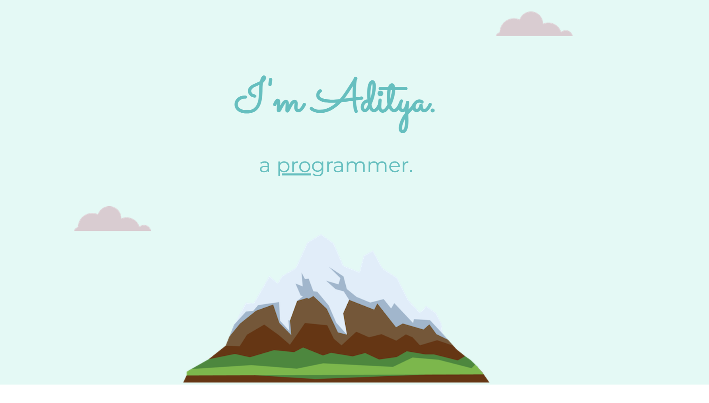
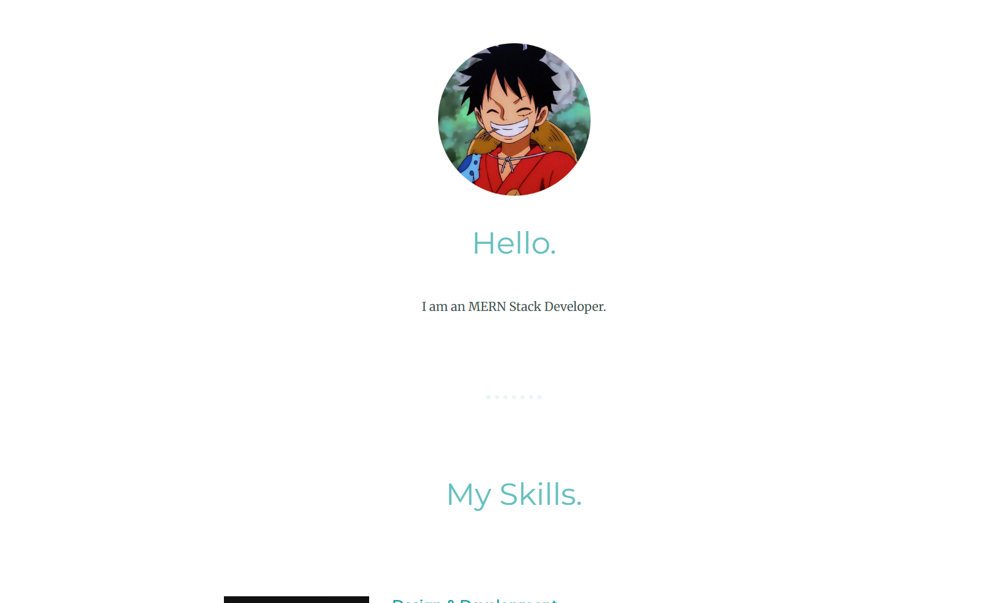
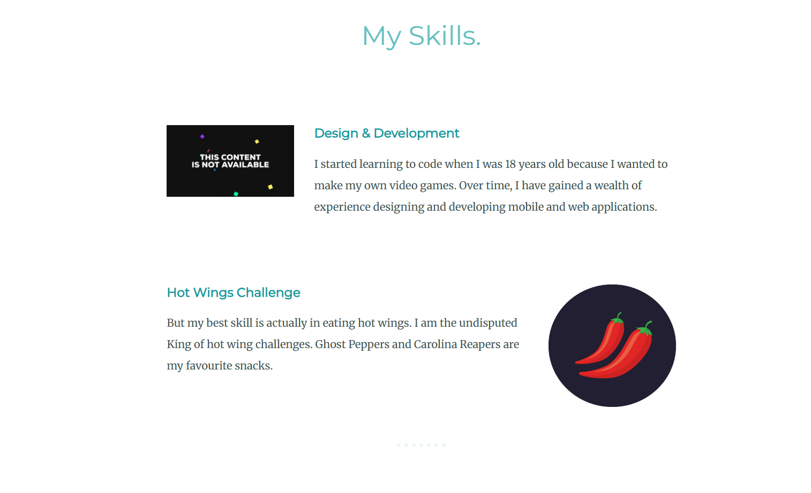
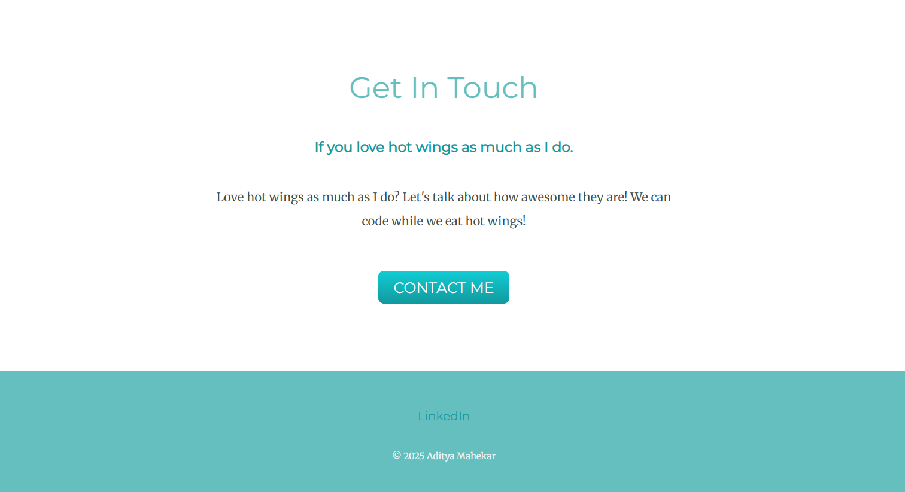

# 🌄 Aditya Mahekar — Simple Personal Portfolio Website

A responsive and minimal **personal portfolio website** built using **HTML**, **CSS**.  
It showcases my skills, interests, and a bit of my fun personality — all in a clean, interactive design.

---

## 🚀 Features

- 🧑‍💻 Responsive design — works smoothly on all devices  
- 💬 Animated headings and hover effects  
- 🎨 Custom theme colors with smooth transitions  
- ⚡ Lightweight (pure HTML, CSS)  
- 📬 Contact button linking directly to LinkedIn or email  
- 🌈 Fun and modern visuals featuring anime-themed design  

---

## 🧠 Tech Stack

| Technology | Description |
|-------------|-------------|
| **HTML5** | Structure and layout of the site |
| **CSS3** | Styling, animations, and responsiveness |

---

## 🖼️ Preview

### Landing Page  

### Profile Section  

### Skills Section  

### Contact Section  

---
